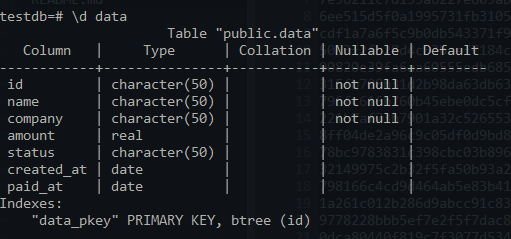
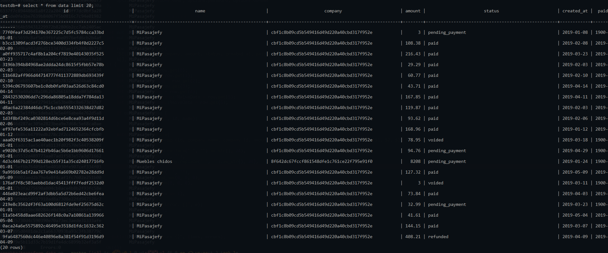
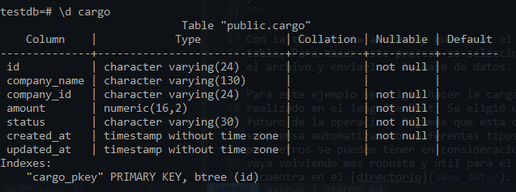
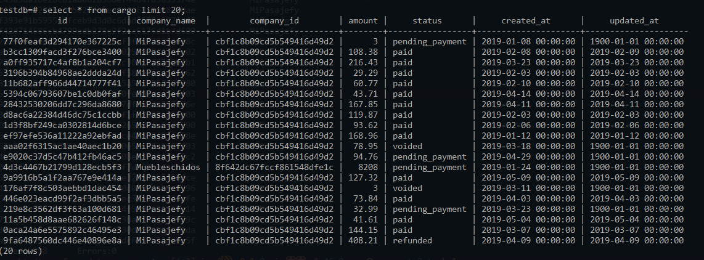
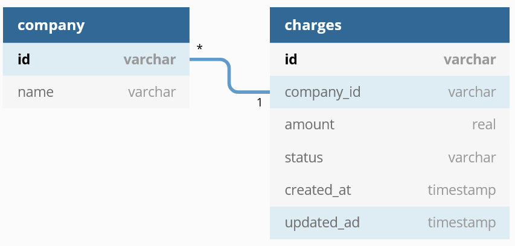
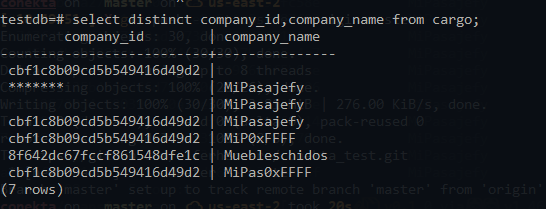
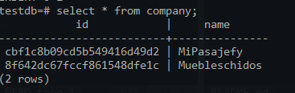
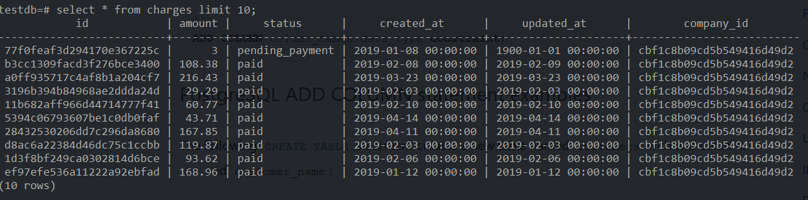
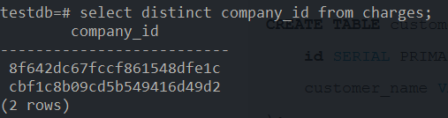
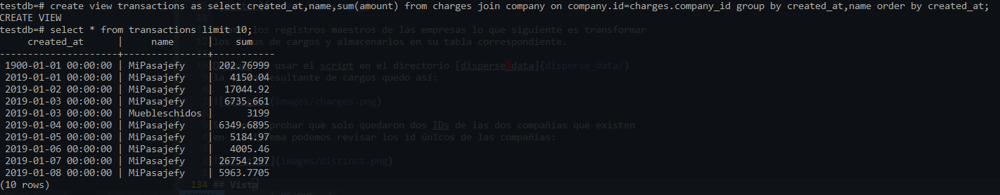

# Prueba tecnica: Data Engineer

## Carga de información

Para la carga de la información una imagen docker de PostgresDB va as ser
utilizada. La razón es que la información tiene una estructura simple y no
necesita documentos complicados (MongoDB) para ser representada en la base de
datos. Además de que los siguientes pasos piden operaciones hechas usando
PostgresDB.

Dado que esto es una prueba se utilizara una imagen de docker corriendo local.
Esto no es recomendable para bases de datos productivas debido a la volatilidad
inherente de los contenedores. Si un contenedor es detenido la información
almacenada en el se perderá. Es posible levantar un contenedor usando un
volumen persistente para mantener una copia de la información. Sin embargo, no
es la practica mas recomendada para bases de datos. Lo mejor es utilizar
servicios de almacenamiento administrados (AWS, Azure, Google Cloud). 

Para instalar el contenedor el siguiente comando es usado

```
docker run -d --name some-postgres -e POSTGRES_PASSWORD=root -p 5432:5432 postgres
```

Este comando crea una imagen de docker corriendo en el background. Para entrar
al contenedor y ver que todo esta funcionando correctamente podemos ejecutar
el comando /bin/bash en el contenedor

```
docker exec some-posgres /bin/bash
```

Esto nos dará acceso al contenedor y al comando **psql** para trabajar con la
base de datos.  Ya dentro del contenedor es necesario crear una base de datos y
una tabla para guardar la información en ella.

La base de datos es creada con este comando:

```
CREATE DATABASE testdb;
```

Una vez creada la base de datos se crea una tabla para almacenar la información

```
CREATE TABLE DATA (
    ID CHAR(50) PRIMARY KEY NOT NULL,
    NAME CHAR(50) NOT NULL,
    COMPANY CHAR(50) NOT NULL,
    AMOUNT REAL,
    STATUS CHAR(50),
    CREATED_AT DATE,
    PAID_AT DATE,
)
```



Con la tabla lista ahora hay que crear el proceso para guardar los datos en la
tabla. Para hacer este proceso se selecciona hacer una rutina en Rust para leer
el archivo y enviarlo a la base de datos.

Para este ejemplo se eligió hacer la carga de los datos utilizando un script
realizado en el lenguaje Rust. Se eligió un lenguaje compilado pensando en el
futuro de la operación. Digamos que esta operación se va a estar repitiendo o
se piensa automatizar con diferentes tipos de archivos y formatos. Todos estos
parámetros se pueden tener en consideración para crear una herramienta que se
vaya volviendo mas robusta y útil para el manejo de los datos. El proyecto se
encuentra en el directorio [save_data](save_data/).

Un ejemplo de los datos cargados en la base de datos.


Este archivo podría ser mejorado incluyendo un archivo de referencia de parseo
para que se pueda crear cualquier tabla en la base de datos utilizando.

En el repositorio se ha dejado el archivo compilado que debería de funcionar
en cualquier plataforma windows. 

## Extracción

Siguiendo la misma lógica que que en el ejercicio anterior, el archivo se creo
utilizando Rust. El objetivo es crear una herramienta compilada que pueda irse
mejorando con el uso. Los parámetros del script se pueden ir ajustando para ir
creando un ejecutable mas versátil. El proyecto se encuentra en el directorio
[extract_data](extract_data/)

## Transformación

La nueva tabla tiene la siguiente estructura:



Como se puede ver los campos ID y company_id se requieren transformar a un
tamaño menor del que vienen en los datos originales. Esa fue una de las
dificultades al trabajar con las transformaciones de la información.

El script para transformar los datos se encuentra en el directorio
[transform_data](transform_data/).

Un ejemplo de los datos cargados en la base de datos.


## Dispersion de la información

Las nuevas tablas con la información dispesa quedarían asi:



Para popular las tablas primero hay que sacar las compañias unicas registradas
en la base de datos. En la siguiente imagen se puede ver que solo existen dos
compañias con registros mal hechos.



Estas dos compañias se guardan en la tabla de company, creando un registro
maestro de las compañias. Los registros quedan asi:



Usando los registros maestros de las empresas lo que siguiente es transformar
los datos de cargos y almacenarlos en su tabla correspondiente.

Despues de usar el script en el directorio [disperse_data](disperse_data/)
la tabla resultante de cargos quedo así:



Solo para probar que solo quedaron dos IDs de las dos compañías que existen
en el sistema podemos revisar los id únicos de las compañías:



## Vista

La vista con la información requerida es creada de la siguiente forma:



Al final de todas las transformaciones las tablas creadas son las siguientes:


